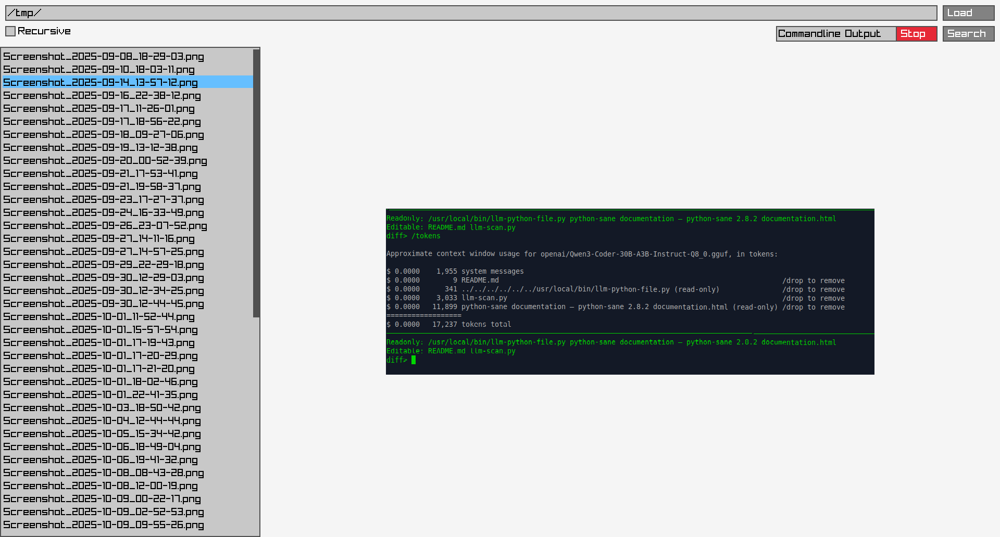

# llm_image_search

An LLM Image Search



## Overview

`llm_image_search` is a graphical tool built with **raylib** that allows you to search through a directory of images using a Large Language Model (LLM).  
It loads images from a folder (optionally recursively), sends each image to an LLM backend (e.g., OpenAI compatible) with a user‑provided search phrase, and lets you keep or discard files based on the model’s answer.

## Features

- Recursive directory loading
- Scrollable, resizable file list panel
- Batch search with automatic file removal
- Real‑time LLM responses displayed in the console
- Simple UI built on raylib (no external GUI toolkit)

## Build Instructions

The project uses a standard **Makefile**. Ensure the required libraries are installed (see *Dependencies* below) and then run:

```bash
make
```

The resulting executable will be named `llm_image_search`.

### macOS Support

On macOS the Makefile automatically selects the correct frameworks for Raylib.  
Install the dependencies with Homebrew:

```bash
brew install raylib curl jansson
```

Then simply run `make` as on Linux; the build will link against the required macOS frameworks (`OpenGL`, `Cocoa`, `IOKit`, `CoreVideo`). No further changes are needed. 

## Dependencies

The program links against the following libraries:

- **raylib** (graphics)
- **libcurl** (HTTP requests)
- **jansson** (JSON parsing)
- **pthread** (multithreading)
- **dl**, **rt**, **X11**, **m** (standard system libs)

On Debian/Ubuntu you can install them with:

```bash
# Install Raylib from source (see https://www.raylib.com/) and other dependencies:
# sudo apt-get install libcurl4-openssl-dev libjansson-dev
```

On Fedora:

```bash
sudo dnf install raylib-devel libcurl-devel jansson-devel
```

## Usage

```bash
./llm_image_search
```

1. Enter the directory containing images.  
2. (Optional) Tick **Recursive** to include sub‑folders.  
3. Click **Load** to populate the file list.  
4. Type a search phrase (e.g., “cat”) and press **Search**.  
5. The LLM will answer “yes” or “no” for each image; you can stop the batch with the **Stop** button.

## License

This project is released under the GPT-3.0 License. See the `LICENSE` file for details.

